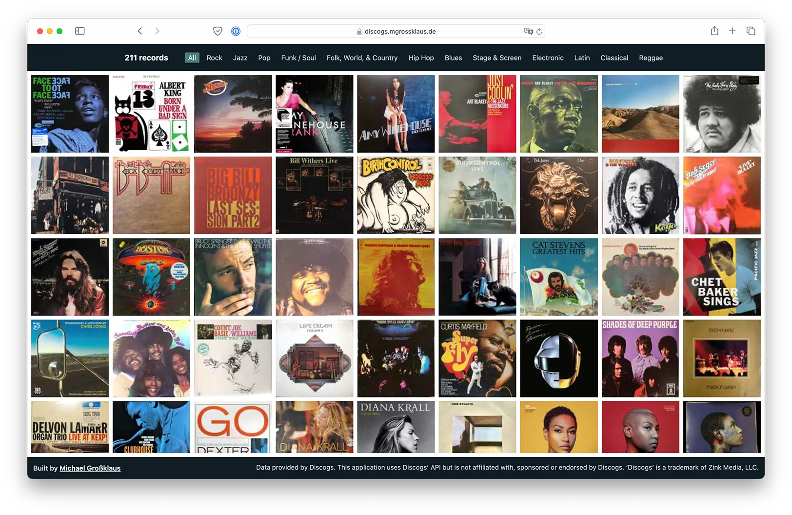

# Discogs Record Collection

Grant access to your Discogs record collection and get a simple overview of all your records.

## Repository

There are two ways to use this repository:

1. `server/` provides a NodeJS server and makes use of OAuth to grant access to a Discogs record collection. This is deployed to [discogs.mgrossklaus.de](https://discogs.mgrossklaus.de) and allows everyone to get an overview of their record collection.
2. `static/` allows you to deploy a static build of your record collection using [Eleventy](https://www.11ty.dev). For that you need to create a personal access token on [https://www.discogs.com/settings/developers](https://www.discogs.com/settings/developers).

Both applications use the same UI (files in `public/` and `views/`).
